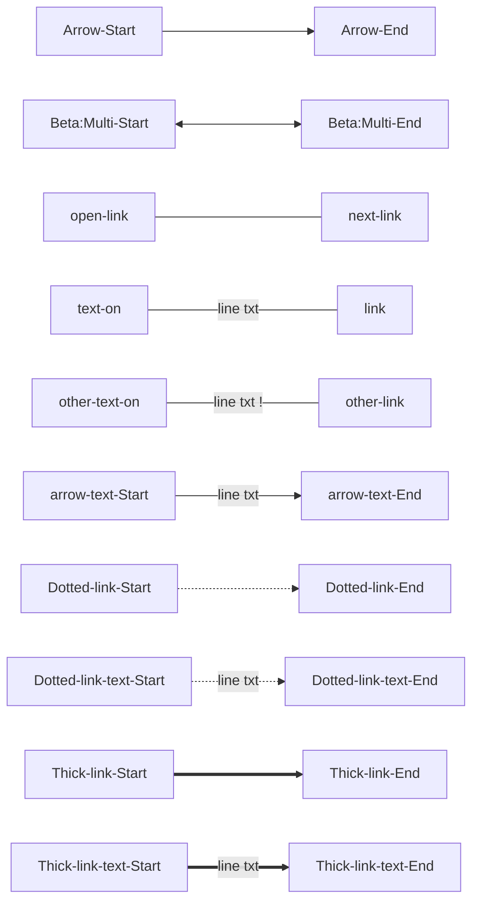

# nodejs API

content level 1

## level 2

content level 2

### level 3

content level 3

#### level 4

content level 4

#### level 4

content level 4

## level 2

content level 2

### level 3

content level 3

### level 3

content level 3