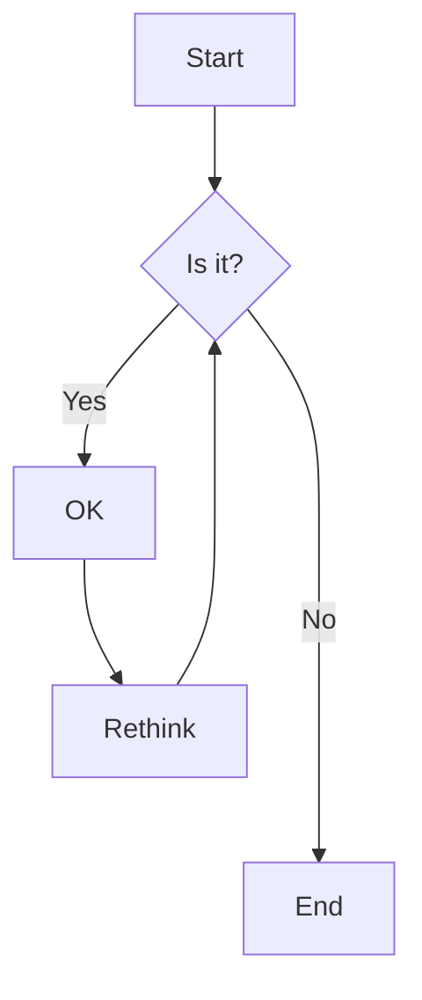

# service API

content level 1



## level 2

content level 2

| 参数      | 说明                         | 类型                                    | 是否必要(necessary/optional/ignore) |
| --------- | ---------------------------- | --------------------------------------- | ----------------------------------- |
| total     | 总条目数                     | Number                                  | N                                   |
| page      | 当前页数                     | Number                                  | N                                   |
| limit     | 每页显示条目个数             | Number                                  | N                                   |
| pageSizes | 每页显示个数选择器的选项设置 | Number                                  | O                                   |
| layout    | 组件布局，子组件名用逗号分隔 | total, sizes, prev, pager, next, jumper | I                                   |

### level 3

content level 3

```js
const service = axios.create({
  // baseURL:'https://github.com:3000'
  baseURL:window.location.hostname==='127.0.0.1'||window.location.hostname==='localhost'?'http://127.0.0.1:3000':'https://github.com:3000',
  withCredentials: false,
})
```

#### level 4

content level 4

::: tip
这是一个提示
:::

::: warning
这是一个警告
:::

::: danger
这是一个危险警告
:::

::: details
这是一个详情块，在 IE / Edge 中不生效
:::

::: danger STOP
危险区域，禁止通行
:::

::: details 点击查看代码
```js
console.log('你好，VuePress！')
```
:::

#### level 4

content level 4

## level 2

content level 2

### level 3

content level 3

### level 3

content level 3